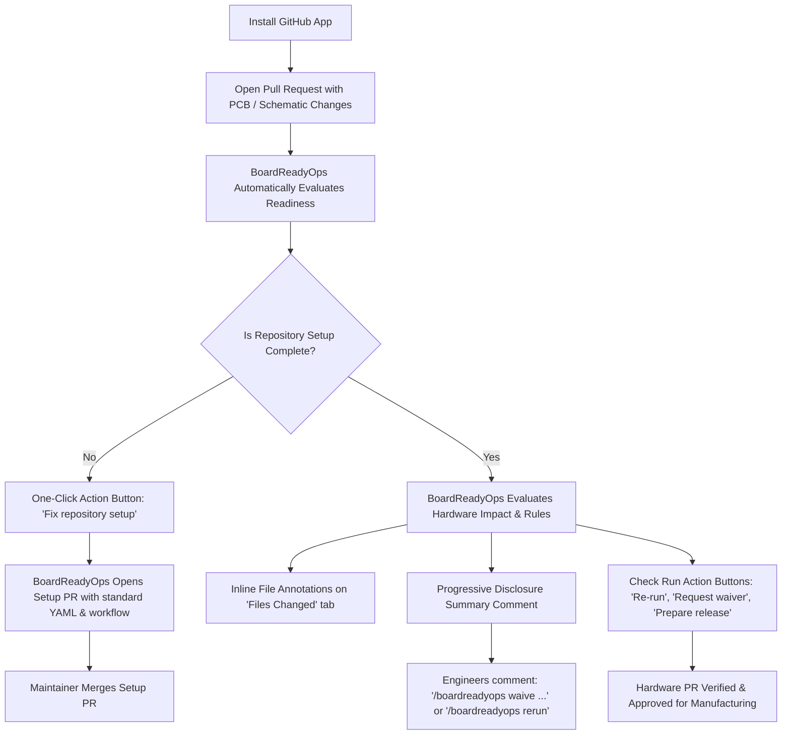

# Zero-Touch, GitHub-Native Hardware Release Platform

## 1. Product Vision

> **"Install once → open a pull request → BoardReadyOps does the rest."**

Traditional hardware verification and release tools suffer from high friction: they require local EDA workstation installations, complex python scripts, manual YAML editing, and frequent context switching between EDA tools, terminal prompts, and external web portals.

BoardReadyOps transforms hardware release governance into a **zero-touch, GitHub-native experience**. The normal hardware developer or reviewer **never** needs to:
- clone the repository locally just to run linting or DRC,
- open a command-line terminal,
- install a CLI binary,
- author `boardreadyops.yml` or GitHub Actions workflows by hand,
- leave GitHub for routine review, waiver, and release operations.

---

## 2. The Zero-Touch Workflow

---

## 3. GitHub-Native Interaction Surfaces

### A. Native File Annotations (Files Changed Tab)
When a hardware pull request touches KiCad schematic netlists, BOM CSVs, or layout files, BoardReadyOps places native annotations directly on the lines of interest:
- **Severity-mapped**: High/Error mapped to `failure`, Medium/Low to `warning`, Info to `notice`.
- **Line bounds**: Constrained safely between lines `1` and `65,535`.
- **CAD binary exclusion**: Binary files (`.kicad_pcb`, `.step`, `.kicad_prl`) are cleanly filtered from line annotations and surfaced in the summary report.

### B. Interactive Check Run Requested Actions
Directly inside the GitHub Check Run interface, engineers can trigger actions with a single click without opening a terminal:
- **`Re-run checks`**: Re-evaluates release readiness on the latest commit.
- **`Fix repository setup`**: Opens a reviewed pull request adding `boardreadyops.yml` and `.github/workflows/readiness-runner.yml`.
- **`Request waiver`**: Opens an audited waiver PR proposing a temporary policy exception for blocking findings.
- **`Prepare release`**: Checks release gates, runs manufacturing handoff validation, and generates the release bundle draft.

### C. Progressive Disclosure PR Comment
Every hardware PR receives an automatically updated comment structured for immediate clarity:
1. **Verdict Banner**: Instant visual signal (`Ready to release` / `Review warnings` / `Release blocked`), confidence score (e.g. `85/100`), and executive summary.
2. **Material Hardware Impact**: Clear deltas for BOM rows, PCB layers, netlist changes, and risk direction.
3. **Blockers & Quick Remedies**: High-severity findings with actionable KiCad remedies and instant waiver command syntax.
4. **Collapsible Details**: `
` blocks enclosing evidence artifacts, execution metrics, and full report links.
5. **Single-Marker Upsert**: Uses `<!-- boardreadyops:release-readiness -->` to edit in place, preventing noisy comment spam.

### D. Pull Request Slash Commands (`/boardreadyops ...`)
Engineers and reviewers can interact directly via PR comments:
- `/boardreadyops status`: Show current release verdict, confidence score, and open blockers.
- `/boardreadyops rerun`: Trigger fresh evaluation on current PR head commit.
- `/boardreadyops explain <rule-id>`: Explain why a rule failed and how to resolve it in KiCad.
- `/boardreadyops diff`: Summarize netlist, layer stack, and BOM deltas against base branch.
- `/boardreadyops release-preview`: Preview the hardware release checklist and sign-off readiness.
- `/boardreadyops setup`: Propose one-click setup PR if configuration is missing.
- `/boardreadyops waive <rule-id> --reason "<reason>"`: Open automated policy waiver PR.
- `/boardreadyops fix [rule-id]`: Get step-by-step remediation guidance.
- `/boardreadyops help`: Display supported commands and required permissions.

---

## 4. Role of the BoardReadyOps Web Application

While daily engineering interactions live entirely inside GitHub, the BoardReadyOps web application serves four strategic enterprise functions:
1. **Portfolio & Governance Oversight**: Cross-repository visibility across all hardware products, revision stages, and manufacturing lines.
2. **Audit Ledger & Compliance Records**: Verifiable history of all release decisions, sign-offs, and expired waivers for ISO 9001, AS9100, and medical device compliance audits.
3. **Deep Diagnostic Inspection**: Interactive Gerber layer viewer, component intelligence (Nexar/Octopart lifecycle, supply-chain availability), and multi-board netlist tracing.
4. **Administration & Security**: Single Sign-On (SAML/Okta), role-based access control, billing/subscription management, and GitHub App installation settings.
